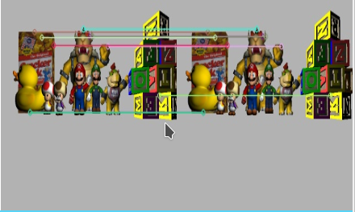
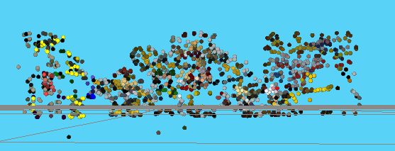
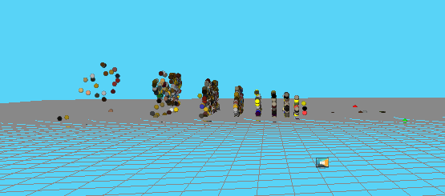
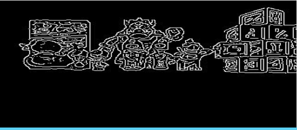
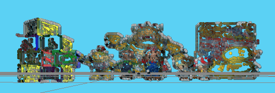
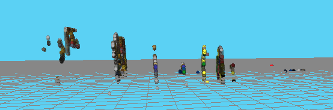
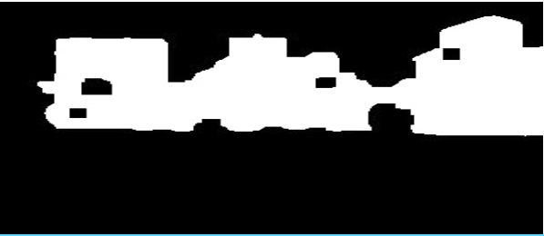
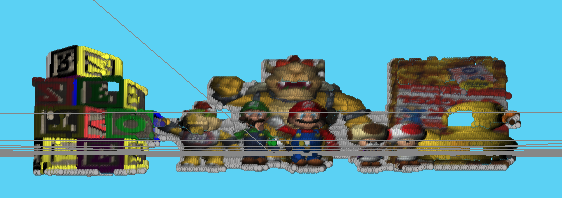
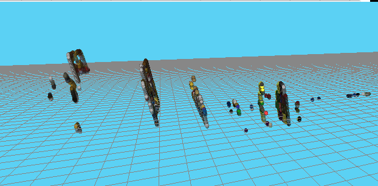

# Diario de Robótica del MOVA

En este diario ire poniendo todos los avances en las prácticas de la asignatura de robotica del Máster de visión de la URJC 

## Reconstrucción 3D

Esta práctica consiste en reconstruir un escenario mediante las imágenes recibidas por dos cámaras.

### Primera versión
En esta primera versión para emparejar los píxeles de las imágenes he usado un [detector ORB](https://docs.opencv.org/3.0-beta/doc/py_tutorials/py_feature2d/py_orb/py_orb.html). Una vez extraidas las características, se he usado un [BFMatcher](https://docs.opencv.org/3.0-beta/doc/py_tutorials/py_feature2d/py_matcher/py_matcher.html) para hacer le emparejado.

Después se hace la retropoyección de cada pareja de puntos y se conprueba como de cerca pasan las lineas, en teoria deberian cortarse pero eso no ocurre, así que se mira el punto más cercano entre ambas. si está por debajo de un límite se toma como bueno, si no, se descarta el punto.

Una vez tenemos ya el punto se toma de la imagen a color el píxel y se pinta en el visor 3d.

 

Como se puede ver en las imágenes el resultado no es demasiado bueno, se intuyen las formas, pero al reconstruir con 1500 puntos se nota que faltan puntos. Esto es debido a que cuando se usan descriptores de características hay menos emparejamientos. Como ventaja tiene lo que tarda en hacerse (1 minuto 15 segundos, siendo el emparejado 0.2 segundos)

<iframe width="560" height="315" src="https://www.youtube.com/embed/M5CtkMH-Yvw" frameborder="0" allow="accelerometer; autoplay; encrypted-media; gyroscope; picture-in-picture" allowfullscreen></iframe>

### Segunda versión
En la versión dos para emparejar los píxeles he optado por reducir el número de píxeles a buscar he usado Canny en la imagen izquierda estando las dos imaǵenes en esacala de grises, asi sabemos que ya tienen información y no intentamos emparejar fondo por ejemplo.

En la imagen se puede ver que ya solo vamos a intentar emparejar esos puntos en blanco y no toda. Después en la para encotrar la pareja lo que he hecho es asumir que es canónica la configuración de las cámaras por lo tanto la busqueda de la pareja se reduce a buscar en la misma horizontal en la otra imagen (es donde está la epipolar en una configuración canónica). para ello se han cogido un parche de 11x11 al rededor del punto de la imagen izquierda y se ha ido comparando cogiendo parches iguales al rededor de cada uno de los puntos de la epipolar desde el píxel el mismo píxel en la imagen derecha y moviendonos a la izquierda (un punto que se ve en un píxel en la imagen izquierda como mucho estará en el mismo pixel de la derecha, pero nunca más a la derecha).

Para saber cómo de buena es la correspondencia se utiliza la función de openCV  `matchTemplate` con la métrica `CCORR_NORMED` que devuelve una medida de correlación. Si no superaba un umbral se descartaba.

El resto es igual que el primer método.

 

Como se puede ver en las imágenes el resultado es mucho mejor que en el anterior, aunque tarda más en ejecutarse (unos 7 minutos, siendo el emparejado 90 segundos).

<iframe width="560" height="315" src="https://www.youtube.com/embed/vMoZPOOJopg" frameborder="0" allow="accelerometer; autoplay; encrypted-media; gyroscope; picture-in-picture" allowfullscreen></iframe>

### Tercera versión
En la tercera la unica diferencia con respecto a la segunda es que se ha aplicado un cierre a la imagen obtenida desde Canny para aumentar el número de píxeles a emparejar.

El resto es igual que el segundo método.

 

Como se puede ver en las imágenes el resultado es todavia mejor, pero en cambio tenemos una perdida de tiempo considerable al llegar a los 25 minutos la reconstrucción.

## Sigue líneas

Esta práctica consiste en seguir una línea con un F1 usando visión y un [controlador PID](https://en.wikipedia.org/wiki/PID_controller).

### Primera Versión

En esta primera versión se establecen 2 puntos, uno cerca del horizonte y otro un poco mas abajo, este segundo punto determina la velocidad de giro y con la diferencia entre el primero y el segundo se saca si es una curva recta o una curva.

<iframe width="560" height="315" src="https://www.youtube.com/embed/IjoKkfNpUN4" frameborder="0" allow="accelerometer; autoplay; encrypted-media; gyroscope; picture-in-picture" allowfullscreen></iframe>

### Segunda Versión

En esta segunda versión se han variado ligeramente los valores de las constantes y de las velocidades máximas para obtener un mejor resultado en la vuelta (más estable)

<iframe width="560" height="315" src="https://www.youtube.com/embed/UKm7d6WgocA" frameborder="0" allow="accelerometer; autoplay; encrypted-media; gyroscope; picture-in-picture" allowfullscreen></iframe>

### Tercera Versión

En esta tercera versión se ha puesto un punto por encima del horizonte para determinar si hay pared o no, si no la hay estamos en recta. Si la hay en curva. y se toma un punto puy cercano al horizonte para determinar la velcidad de giro

<iframe width="560" height="315" src="https://www.youtube.com/embed/-REtZqYeQUQ" frameborder="0" allow="accelerometer; autoplay; encrypted-media; gyroscope; picture-in-picture" allowfullscreen></iframe>

